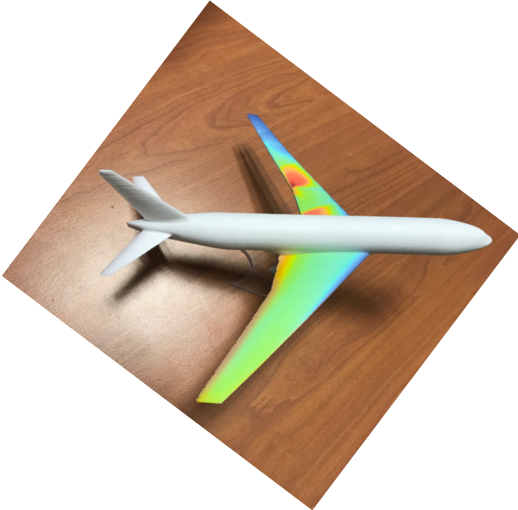

# About

I am an full professor in Aerospace Engineering (AE) at **ISAE-SUPAERO**, attached to the Aerospace Design group at **TSAAElab** (before I was researcher at ICA CNRS).

I lead the **MID2** group — *Multidisciplinary optimization for aerospace Innovation:
eco Design and Data* — which develops methods for design optimization and data-driven/AI-assisted decision-making, with applications in aerospace engineering.

The story of my life [TO READ]

# My Starting Point (polished with ChatGPT)

Back in high school in France, a small group of us—the geeks, perhaps—owned an HP 48G calculator. Looking back, that little machine probably changed the course of my career.

It introduced me to **Reverse Polish Notation (RPN)**, then to the **RPL programming language**, and eventually to something even more fascinating: **assembly language**. It was the first time I experienced what programming really meant—understanding how a machine thinks.

- [More on the HP 48](https://en.wikipedia.org/wiki/HP_48_series)
- [More on Assembly language](https://en.wikipedia.org/wiki/Assembly_language)

University was my next turning point. During my final research project at **ENSEIRB (University of Bordeaux)**, I started programming in **C**, learning from Dennis Ritchie's legendary book while implementing algorithms such as **2D FFTs** and the **Hough Transform**.

Around the same period, during my MSc in Mechatronics, I remember implementing the **Simplex algorithm** directly on my HP 48G. Yes, on a calculator. I also built some of my first **multilayer perceptrons (MLPs)** in MATLAB as part of an *Artificial Neural Networks* course.

Looking back, I realize that machine learning had already entered the story—long before it became fashionable.

- [More on Dennis Ritchie](https://en.wikipedia.org/wiki/Dennis_Ritchie)
- [More on the Simplex algorithm](https://en.wikipedia.org/wiki/Simplex_algorithm)

Around that time, I also discovered **structural dynamics** and, with it, a whole new way of thinking about engineering problems. The **Rayleigh–Ritz method**, finite element formulations, modal analysis, and numerical approximations fascinated me because they beautifully connected mathematics, physics, and computation. My bookshelf quickly filled with classics such as *Vibrations des structures* by **Georges Venizelos**, *Analyse des structures par la méthode des éléments finis* by **Jean-François Imbert**, *The Finite Element Method* by **O. C. Zienkiewicz**, and *Méthode des éléments finis : Approche pratique en mécanique des structures* by **Michel Cazenave**. Looking back, I realize how fortunate we were as students: we had the time to read these books from cover to cover, work through the derivations, and truly understand the ideas rather than simply applying the methods. Those books didn't just teach algorithms—they shaped the way I still approach engineering today.

- [*Vibrations des structures* — Georges Venizelos](https://www.decitre.fr/livres/vibrations-des-structures-9782710805956.html)
- [*Analyse des structures par la méthode des éléments finis* — Jean-François Imbert](https://www.eyrolles.com/Sciences/Livre/analyse-des-structures-par-la-methode-des-elements-finis-9782866016923/)
- [*The Finite Element Method, Fifth Edition, Volume 1: The Basis* — O. C. Zienkiewicz & R. L. Taylor](https://shop.elsevier.com/books/the-finite-element-method-volume-1/zienkiewicz/978-0-7506-6320-7)
- [*Méthode des éléments finis : Approche pratique en mécanique des structures* — Michel Cazenave](https://www.editions-ellipses.fr/accueil/4402-methode-des-elements-finis-approche-pratique-en-mecanique-des-structures-9782729833155.html)

There was no Stack Overflow, no GitHub, and certainly no AI assistant. When you wanted to understand an algorithm, you opened a book, took a pencil, and worked through the derivation until it made sense.

Then came my PhD.

MATLAB became my everyday scientific companion for **wavelet analysis**, **modal analysis**, and **vibration processing**. After years of wrestling with multidimensional arrays in C, MATLAB felt almost magical: concise, expressive, and designed for scientific computing.

Cleve Moler's books were constant companions. Years later, I had the pleasure of meeting **Cleve Moler**, one of MATLAB's founders—a memorable moment for someone who had learned so much from his work.

At the same time, Stéphane Mallat's *Wavelet Tour* rarely left my desk, while Pete Avitabile's *Modal Space* papers became an invaluable source of practical engineering insight.

My PhD also marked my first real experience with machine learning applied to engineering. I built the database of damaged / undamaged structures with FEA, developed MATLAB implementations of MLPs for pattern recognition, and learned from Gérard Dreyfus et al (including Manuel Samuelides) excellent book *Apprentissage statistique : réseaux de neurones, cartes topologiques, machines à vecteurs supports* (Eyrolles, 2008).

- [More on Cleve Moler](https://en.wikipedia.org/wiki/Cleve_Moler)
- [More on Stéphane Mallat](https://www.college-de-france.fr/en/person/stephane-mallat)
- [More on Pete Avitabile](https://www.uml.edu/research/sdasl/education/modal-space.aspx)
- [More on Manuel Samuelides](https://www.researchgate.net/profile/Manuel-Samuelides/4)

Then, in 2006, another unexpected chapter began.

I became **Manuel Samuelides' colleague**, and a few years later we started collaborating on structural optimization (with Airbus/Onera on Mixture of Experts (already GP aka Kriging). It's funny how books that shape your education sometimes lead you to work alongside their authors. Oh Finally,  Manuel also introduced me to Nathalie Bartoli at ONERA. She will become on of my strongest partner in research (on the SMT project started with Prof. Martins).

## Why I Still Teach with MATLAB

People often ask me why I still teach with MATLAB, even though I also use and teach **Python** and **Julia**.

The answer has very little to do with syntax... let's check This Post, there is a nice comparison of Matlab (Julia) and Python.  who wins?
[Quadratic Form](https://mid2supaero.github.io/general/2026/07/19/quadratic.html)

One of MATLAB's greatest strengths, in my opinion, is the quality of its documentation. Every important numerical function is carefully documented, and the implementation is almost always linked to the original scientific literature.

Take `fft`, for example. Its documentation doesn't just explain how to call the function—it points you directly to the algorithms behind it:

1. FFTW — https://www.fftw.org
2. Frigo, M., & Johnson, S. G. *FFTW: An Adaptive Software Architecture for the FFT*. *Proceedings of the International Conference on Acoustics, Speech, and Signal Processing (ICASSP)*, 1998.

For students, this changes everything.

Software stops being a black box and becomes a gateway to the scientific literature. A single function call can lead to the original paper, then to the underlying mathematics, and eventually to a deeper understanding of the field.

I feel the same way about beautifully crafted scientific figures. A good figure can explain an idea faster than pages of equations. The [MIT LAE Seminar](https://github.com/SichengHe/MIT_LAE_seminar) is a wonderful example of this philosophy.

## And Then...

Then came **Python 2.4**, during the final year of my PhD.

Then **GitHub** changed how we collaborate.

Then **Google Colab** made reproducible computing accessible to everyone.

Then **ChatGPT**, **Claude**, **Gemini**, **AntiGravity**, and the entire new generation of AI assistants fundamentally changed how we write code, explore ideas, and learn.

And the story is still being written.

---

I think the common thread isn't MATLAB, C, Python, or AI.

It's curiosity.

From an HP 48G calculator to today's AI copilots, every new tool has been another opportunity to learn, understand a little more deeply, and pass that knowledge on to the next generation.

PS: SMT has been efficiently refactored by Claude and Remi Lafage (ONERA).

Since 2017, I'm part of SMT The Surrogate Modeling Toolbox opensource project:

[SMT Github](https://github.com/SMTorg/SMT)

[SMT Documentation](https://smt.readthedocs.io/en/latest/)

## Affiliation

Institut Supérieur de l'Aéronautique et de l'Espace (ISAE-SUPAERO)
10, avenue Marc Pellegrin, BP 54032 — 31055 Toulouse CEDEX 4, France

# Contact

📥 joseph.morlier at isae-supaero.fr
Tel: +33 (0)5 61 33 81 31

- [ISAE-SUPAERO personnel page](https://personnel.isae-supaero.fr/joseph-morlier/?lang=fr)
- [LinkedIn](https://www.linkedin.com/in/joseph-morlier-890176168/)
- [Google Maps](https://www.google.com/maps/place/ISAE-SUPAERO/@43.5664595,1.4729086,17z)

## Elsewhere

- [ISAE-SUPAERO personnel page](https://personnel.isae-supaero.fr/joseph-morlier/?lang=fr)
- [LinkedIn](https://www.linkedin.com/in/joseph-morlier-890176168/)
- [Google Scholar](https://scholar.google.fr/citations?user=wi1HSroAAAAJ&hl=fr)
- [Webofsciences](https://www.webofscience.com/wos/author/rid/Y-1209-2019)
- [Openalex](https://openalex.org/authors/A5005187572)
- [ORCID](https://orcid.org/0000-0002-1511-2086)

# HelloProf on buy me a coffee

Contact me if you need help
[coffee](https://buymeacoffee.com/helloprof)
